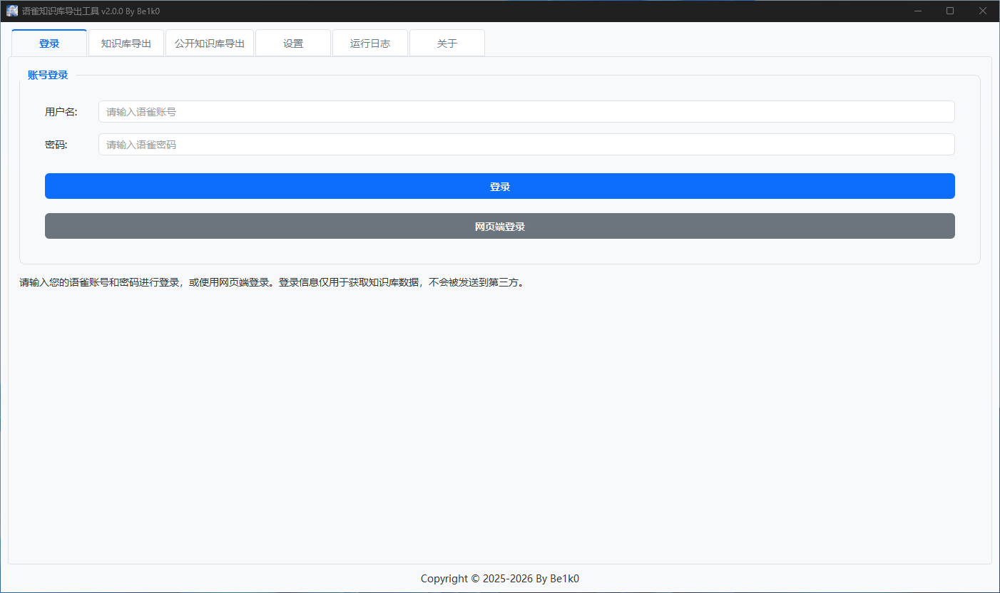
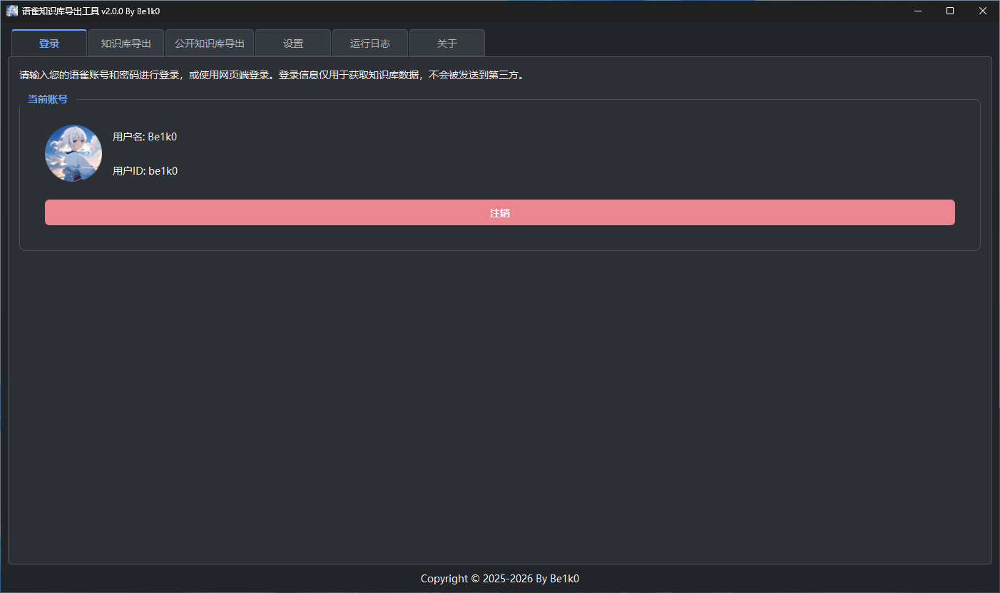
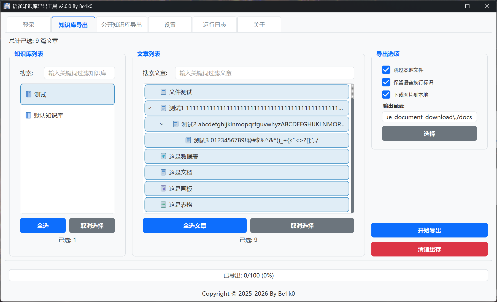
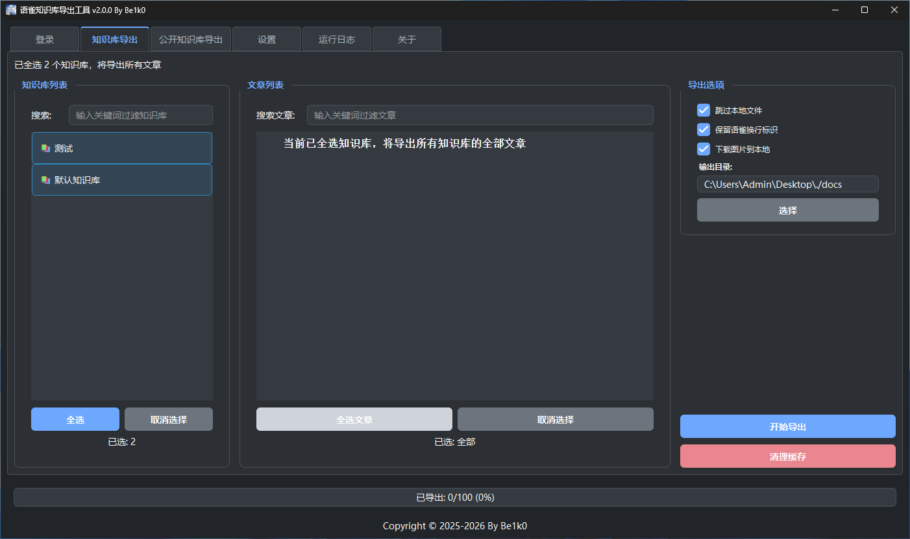
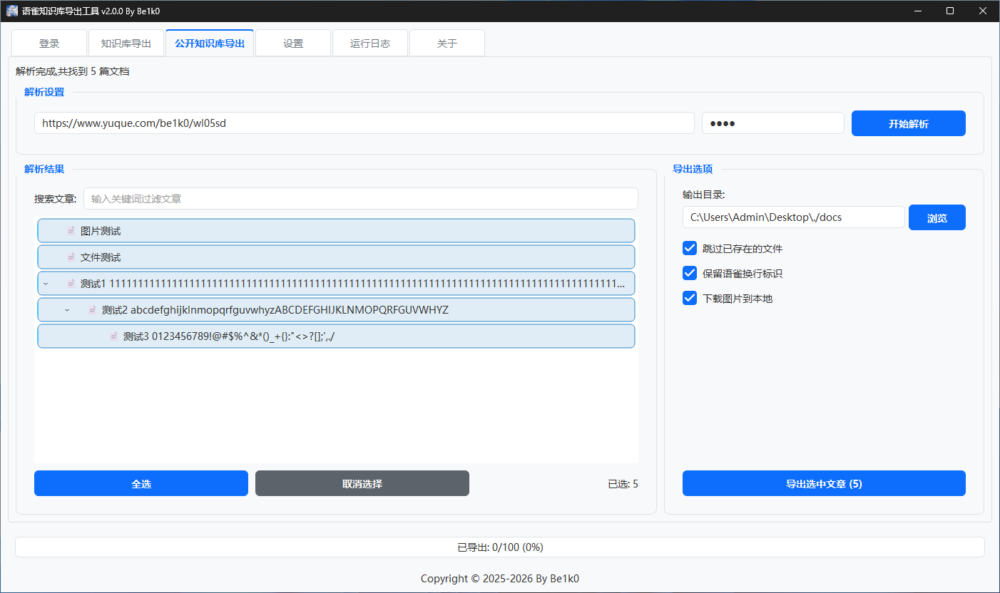
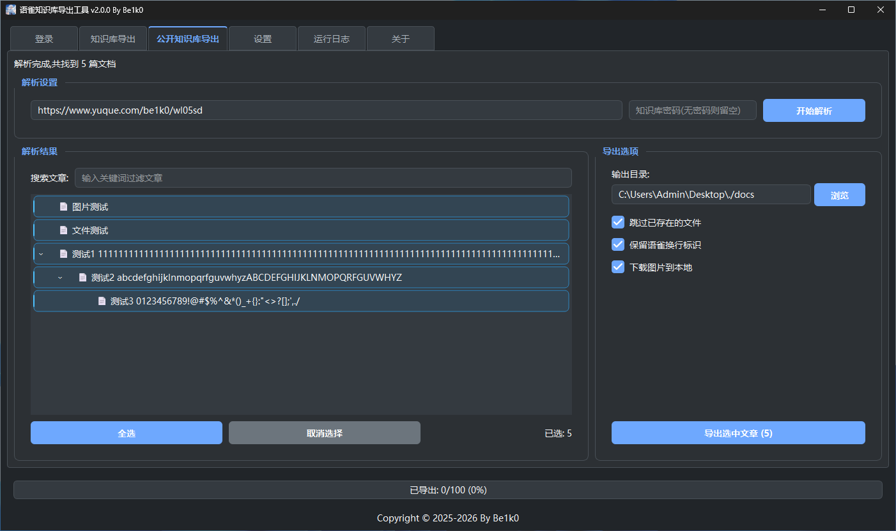
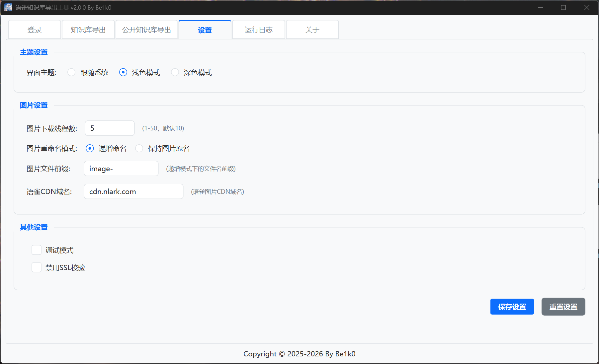
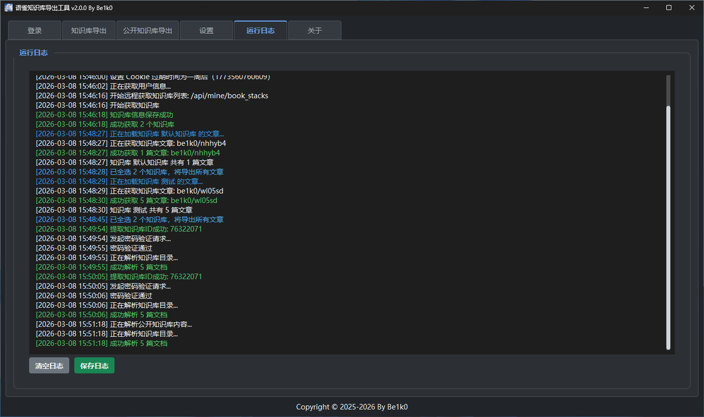
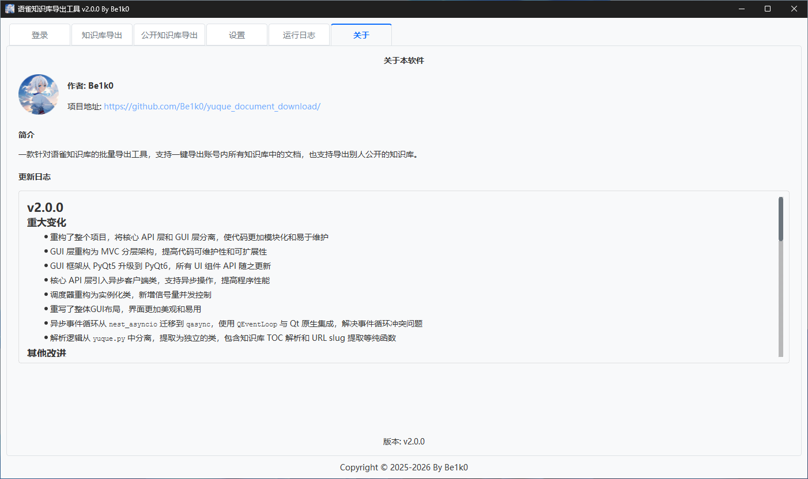

# 语雀知识库导出工具

一款针对语雀知识库的批量导出工具，支持一键导出账号内所有知识库中的文档，也支持导出别人公开的知识库。

## 功能特点

### 账号管理

- 支持语雀账号密码登录、网页端登录两种方式
- 自动持久化登录状态，无需重复登录

### 知识库批量导出

- 登录后自动获取用户所有知识库列表
- 支持批量选择多个知识库同时导出
- 支持知识库内导出指定层级中的文档
- 支持导出别人公开的知识库
- 智能缓存知识库信息

### 文档导出

- 支持导出为 Markdown 格式
- 支持保留或移除语雀特定的换行标识
- 智能跳过已下载文件，支持增量更新
- 保留语雀内原有的文档层级结构

### 图片处理

- 自动下载文档中的所有图片
- 自动处理语雀图片链接，确保本地可访问
- 支持多线程并发下载

### 用户界面

- 现代化图形界面，操作直观简洁
- 支持亮色 / 暗色 两种主题切换，也可以选择跟随系统主题
- 实时展示导出进度、状态、日志信息
- 支持自定义输出目录选择

## 界面预览




















## 快速开始

### 环境要求

- Windows 10及以上
- Ubuntu 22.04及以上
- Python 3.12 或更高版本（仅源码环境运行需要）

### 使用方式

#### 方式一：直接使用（推荐）

1. 下载最新版本的可执行文件
2. 双击运行 `语雀知识库导出工具.exe`
3. 开始使用

#### 方式二：源码运行

1. 克隆或下载本仓库

```bash
git clone https://github.com/Be1k0/yuque_document_download.git
cd yuque_document_download
```

2. 安装依赖

```bash
pip install -r requirements.txt
```

3. 运行程序

```bash
python main.py
```

## 更新日志

### v2.1.0

- 增加公开知识库按原有文件层级导出
- 增加下载失败项统计
- 增加使用GitHub Actions自动构建可执行文件
- 优化知识库文档类型识别，并将原有的emoji图标替换成svg图标
- 优化拦截非文档的空文件写入
- 优化调试日志记录，屏蔽敏感信息
- 优化图片链接正则提取与写入流程
- 优化设置页面中的单选框样式
- 修复带密码解析时的全局 Cookie 污染问题
- 修复多级文章树复选冲突及进度条文字残留
- 修复搜索文章时出现的报错
- 修复导出因跳过分组标题导致的进度统计丢失问题
- 修复导出键冲突与请求异常问题，统一知识库命名空间解析

---

### v2.0.0

#### 重大变化
- 重构了整个项目，将核心 API 层和 GUI 层分离，使代码更加模块化和易于维护
- GUI 层重构为 MVC 分层架构，提高代码可维护性和可扩展性
- GUI 框架从 PyQt5 升级到 PyQt6，所有 UI 组件 API 随之更新
- 核心 API 层引入异步客户端类，支持异步操作，提高程序性能
- 调度器重构为实例化类，新增信号量并发控制
- 重写了整体GUI布局，界面更加美观和易用
- 异步事件循环从 `nest_asyncio` 迁移到 `qasync`，使用 `QEventLoop` 与 Qt 原生集成，解决事件循环冲突问题
- 解析逻辑从 `yuque.py` 中分离，提取为独立的类，包含知识库 TOC 解析和 URL slug 提取等纯函数

#### 其他改进
- 新增禁用 SSL 证书功能，允许用户禁用 SSL 证书验证，解决部分网络环境下的连接问题
- 新增主题切换功能，支持亮色、暗色两种主题，可以选择自动跟随系统主题
- 新增完整的自定义异常体系，包括基础异常类和具体异常类
- 新增版本更新日志，方便用户了解每次更新的内容
- 新增公开知识库导出功能
- 优化路径管理逻辑，同时兼容 PyInstaller 和 Nuitka 两种打包方式
- 优化错误处理机制，提升程序稳定性
- 优化日志记录和异常处理
- 优化文章层级显示效果
- 图片下载线程由最高30改为最高50

---

### v1.1.0

- 新增语雀网页端登陆功能
- 新增文档层级结构支持，实现文档层级显示和交互功能
- 优化图片下载为独立线程
- 优化页面布局和整体代码结构
- 优化设置的保存功能
- 优化头像加载逻辑
- 优化图片下载前的检查逻辑
- 修复因知识库内有同名文档导致出现文档跳过下载的问题

---

### v1.0.0

- 首次发布
- 支持语雀知识库批量导出
- 图形用户界面
- 图片自动下载
- 多线程并发处理
- 智能缓存机制

## 更新计划

- [ ] 增加支持更多的导出格式，如PDF、Word、JPG等

- [ ] 增加适配其他非文档类型的导出功能，如图表、Excel等

- [ ] 增加导出文档里面的图片或视频等文件

- [x] 增加其他公开知识库的导出功能

- [x] 增加UI夜间主题

  ...

## 贡献指南

欢迎提交 Issue 和 Pull Request 来帮助改进这个项目！

## 许可证

本项目采用 GPL 许可证 - 查看 [LICENSE](LICENSE) 文件了解详情

## 作者

**Be1k0** - [GitHub](https://github.com/Be1k0)

---

如果这个项目对您有帮助，请给个 ⭐ Star 支持一下！